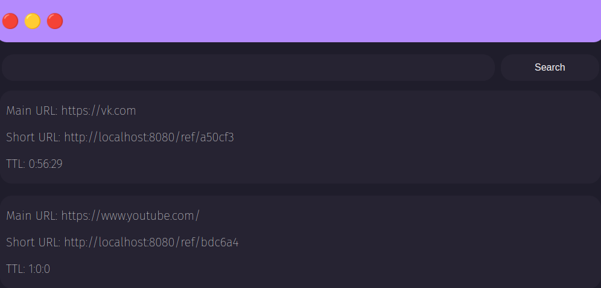

# URL Shortener
URL shortener based on GoLang and Redis. <br>
All data is stored in Redis. <br>
Client abbreviations are stored in cookies and are checked for TTL

## Running
- ```Redis```
 > Starting redis server <br>
``` bash
$ sudo redis-server
```

- ```GoLand```
> Starting server
``` bash
$ go run shorter.go
```

## Interface


## Languages and Tools:
<p align="left"> <a href="https://golang.org" target="_blank" rel="noreferrer">  </a> <a href="https://redis.io" target="_blank" rel="noreferrer">  </a> </p>
